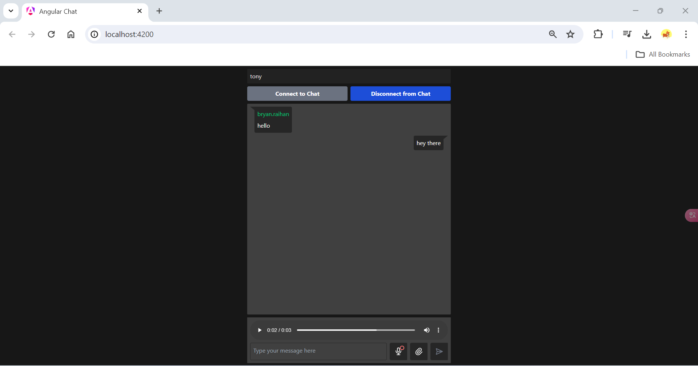

# Community Chat App

Welcome to the Community Chat App! This prototype aims to create a real-time community chat platform where people can seamlessly share their thoughts with others who share similar interests. No login or authentication is required to mimic natural societal interactions.

## Technologies Used

- **Frontend:** Angular
- **Backend:** Node.js

## Getting Started

### Prerequisites

Make sure you have `pnpm` installed globally on your system. If not, you can install it via npm:

1. Install pnpm `npm install -g pnpm`
2. Install dependencies: `npm install`
3. Start servers first: `npm run dev:server` then start client: `npm run dev:front`

## App Preview

